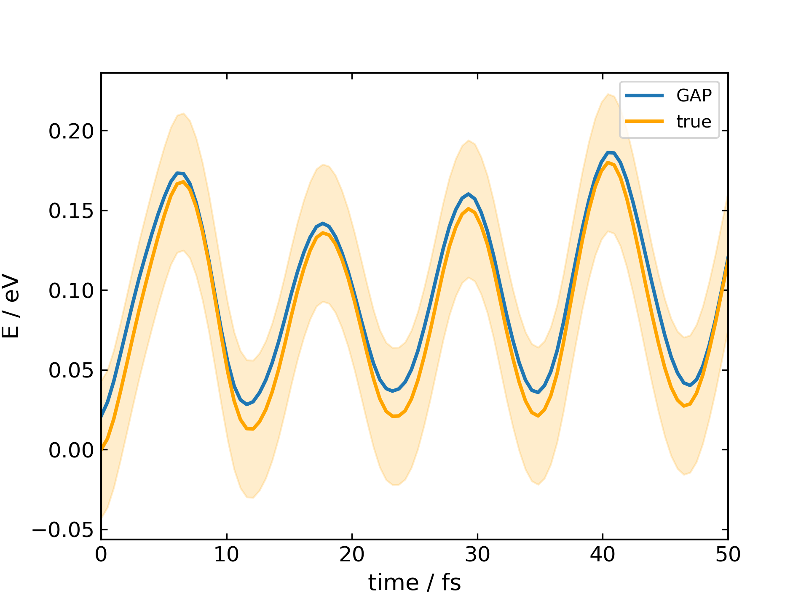

## Examples
Here we'll walk through how to generate a GAP potential for a few examples
from scratch in a few hours. Several other minimal examples are also in
 this directory

#### Contents 
***
(1) benzene.py, single benzene molecule at DFTB (DFTB+)

(2) methane.py, single methane molecule using a PBE/def2-SVP ground truth (ORCA)

(3) diels_ader.py, MP2/TZ quality GAP around the TS for reactive dynamics (ORCA)

(2) water.py, bulk water (DFTB+)

(3) water_methane.py, training a 'solute-solvent' GAP for methane in water (DFTB+)

(4) water_methane_md.py, running molecular dynamics with the water_methane model


> **_NOTE:_**  These examples require a working DFTB+ and/or ORCA installation

### Water (~1h)
***

First import `gaptrian` and set the number of available processing cores for
training. For such a fast ground truth method four cores is sufficent

```python
import gaptrain as gt
gt.GTConfig.n_cores = 4
```

define the system as a cubic box with a side length of 10 Å, then populate it 
with 20 water molecules

```python
h2o = gt.System(box_size=[10, 10, 10])
h2o.add_solvent('h2o', n=20)
```

and train using intra+inter molecular decomposition using active learning with 
all the defaults, which comprise a 1 ps maximum active learning time, a 1 kcal 
mol-1 per molecule energy threshold for adding a configuration among others.

```python
data, gap = gt.active.train_ii(h2o, method_name='dftb')
```

Once the training is complete a GAP object is returned along with the configrations
(data) that is was trained on. To run a dynamics with ASE using the potential 

```python
traj = gt.md.run_gapmd(configuration=h2o.random(),
                       gap=gap,
                       temp=300,     # Kelvin
                       dt=0.5,       # femtoseconds
                       interval=5,   # frames
                       ps=1,         # picoseconds
                       n_cores=4)

traj.save(filename='traj.xyz')
```

where the configuration is generated from the system by placing molecules
at random positions and orientations with a minimum intermolecular distance of
 1.7 Å.


### Methane (~1h)
***

To train a GAP for a single methane molecule in the gas phase at the PBE/def2-SVP
level the system is initialised in the same way as water but this time defining some
keywords for ORCA to run an energy and gradient (EnGrad) calculation

```python
import gaptrain as gt
from autode.wrappers.keywords import GradientKeywords
gt.GTConfig.n_cores = 8
gt.GTConfig.orca_keywords = GradientKeywords(['PBE', 'def2-SVP', 'EnGrad'])

methane = gt.System(box_size=[10, 10, 10])
methane.add_molecules(gt.Molecule('methane.xyz'))
```

> **_NOTE:_**  While the box size is not used for the molecular DFT calculation in ORCA it is still a required attribute for a system

then train the single molecule with active learning at 1000 K, which should take
around 20 minutes

```python
data, gap = gt.active.train(methane,  method_name='orca', temp=1000)
```

Running dynamics and calculated predicted energies vs the ground truth is another 
few lines

```python
traj = gt.md.run_gapmd(configuration=methane.random(),
                       gap=gap,
                       temp=500,    # Kelvin
                       dt=0.5,      # fs
                       interval=1,  # frames
                       fs=50,
                       n_cores=4)
traj.save(filename='traj.xyz')

pred = gt.Data('traj.xyz')
pred.parallel_gap(gap=gap)

true = gt.Data('traj.xyz')
true.parallel_orca()
```

and then to plot the resulting relative energies over time we have some matplotlib
and numpy 

```python
import numpy as np
import matplotlib.pyplot as plt

plt.plot(np.linspace(0, 50, len(pred)),                  # 0 -> 50 fs
         pred.energies() - np.min(true.energies()),      # rel energies
         label='GAP', lw=2)

plt.plot(np.linspace(0, 50, len(true)),
         true.energies() - np.min(true.energies()),
         label='true', c='orange', lw=2)

# plot the region of 'chemical accuracy' 1 kcal mol-1 = 0.043 eV
plt.fill_between(np.linspace(0, 50, len(true)),
                 y1=true.energies() - np.min(true.energies()) - 0.043,
                 y2=true.energies() - np.min(true.energies()) + 0.043,
                 alpha=0.2, color='orange')

plt.xlabel('time / fs')
plt.ylabel('E / eV')
plt.legend()
plt.savefig('energies_vs_time_methane.png', dpi=300)
```




### Diels-Alder (~8h)
***

To train a GAP to an MP2/TZ ground truth over a transition state is relatively 
straightforward. First find the TS for the Diels-Alder reaction between 
ethene and butadiene with `autodE`

```python
import autode as ade
ade.Config.n_cores = 8
ade.Config.ORCA.keywords.set_functional('PBE')

rxn = ade.Reaction('C=CC=C.C=C>>C1=CCCCC1')
rxn.locate_transition_state()
rxn.ts.print_xyz_file(filename='ts.xyz')
```

then use the transition state geometry to train from, using a fast to evaluate
PBE/DZ ground truth and a ~2 kcal mol-1 (~0.1 eV) threshold for adding configurations

```python
gt.GTConfig.orca_keywords = GradientKeywords(['PBE', 'def2-SVP', 'EnGrad'])

da_ts = gt.System(box_size=[10, 10, 10])
da_ts.add_molecules(gt.Molecule('ts.xyz'))

data, gap = gt.active.train(da_ts,
                            method_name='orca',
                            temp=500,                 # Kelvin
                            active_e_thresh=0.1,      # eV
                            max_time_active_fs=200,   # femtoseconds
                            fix_init_config=True)
```

once the GAP has been trained the PBE/DZ data can be 'uplifted' to MP2/TZ by
re-evaluating energies and forces at the new level and retraining the GAP

```python
gt.GTConfig.orca_keywords = GradientKeywords(['RI-MP2', 'def2-TZVP', 'TightSCF',
                                              'AutoAux', 'NoFrozenCore', 'EnGrad'])
data.parallel_orca()

gap.train(data)
```

finally to run and save a short GAP-MD trajectory

```python
traj = gt.md.run_gapmd(configuration=da_ts.random(),
                       gap=gap,
                       temp=50,      # Kelvin
                       dt=0.5,       # femtoseconds
                       interval=1,   # frames
                       fs=400,       # femtoseconds
                       n_cores=4)

traj.save('da_mp2_traj.xyz')
```


