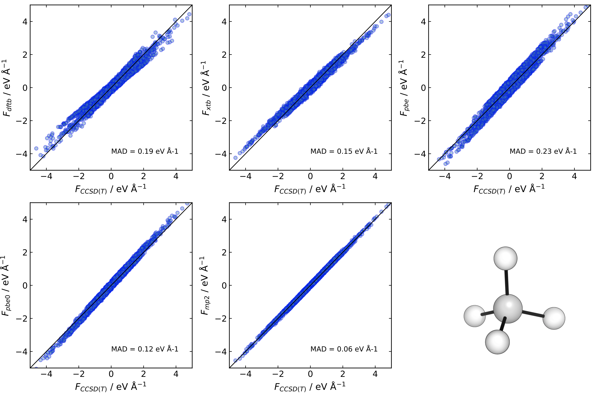
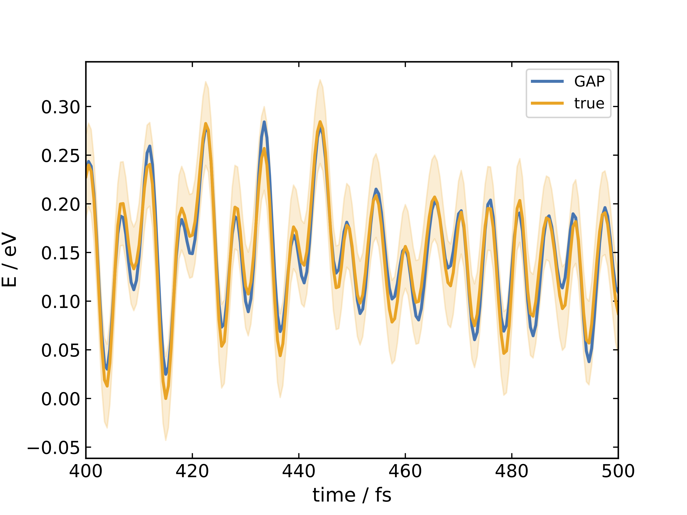
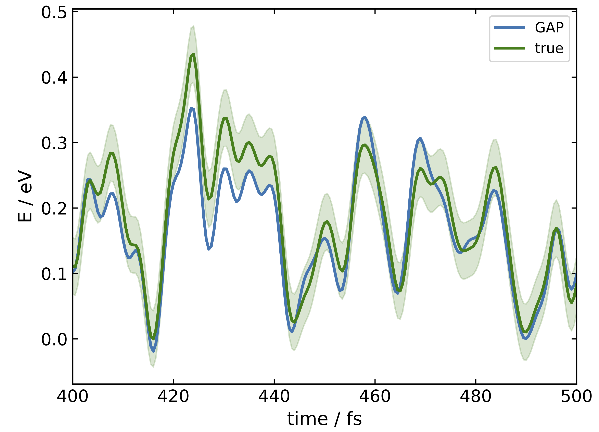

## Mixed energy and force methods
Gaussian approximation potentials make use of energies and forces to fit the potential. 
However, they need not be of the same level of theory (or particularly well converged,
as noted in the tutorial review[1]). For high-level coupled-cluster potentials where 
gradients are expensive to calculate the forces may be evaluated at a different level
of theory to the energies, provided they are within the 'assumed error' (σ<sub>F</sub>)
to the true forces.

### Force errors
Generating frames using a DFTB(3ob) MD simulation and evaluating the force components at 
several levels of theory (*methane_F.py*) suggests that using hybrid DFT or MP2 forces in
combination with CCSD(T) energies should be sufficient to train a CCSD(T)-quality GAP. The
average error is roughly the same as the optimised σ<sub>F</sub> hyperparameter (0.1 eV Å<sup>-1</sup>).



Similar results are obtained for (molecular) water.

### Mixed energy and force GAPs
#### 0. Methane
Training a GAP on CCSD(T) energies and MP2 forces is sufficient to generate a GAP within
1 kcal mol-1 of the true CC surface. Using active learning at XTB to sample the configuration 
space, MP2 forces and CC energies highly accurate methane dynamics can be propagated in just
5 minutes of training time (on 10 cores, *methane_train.py*, *methane_val.py*).



where the 'true' corresponds to CCSD(T)/def2-TZVP and the time the position in a short 500 K
MD simulation using the trained GAP.

#### 1. Methanol
Generating a GAP using active learning (AL) in parallel can lead to an overcomplete set of configurations.
This is because in the initial stages the independent MD can sample similar regions of configuration space,
which in turn do not provide much information for the fit. Selecting the most diverse set of configurations
is therefore advantageous when the energy and forces of each are going to be reevaluated. Training a GAP for
methanol using XTB AL then evaluating MP2/def2-TZVP energies and gradients using different number of CUR[2]
selected configurations on the SOAP kernel matrix (*methanol_cur_select.py*).

```
n_configurations        τ_acc
190                 1000.0 ± 0.0 fs
160                 1000.0 ± 0.0 fs
130                 1000.0 ± 0.0 fs
100                 1000.0 ± 0.0 fs
70                  1000.0 ± 0.0 fs
40                  106.67 ± 30.31 fs
```

For this system therefore the number of required configurations is less than half, if a τ_acc of 1 ps is
desired.

##### 2. Acetic acid
Employing CUR selection for a slightly larger 8-atom system (AcOH) allows for an accurate CCSD(T)-quality
GAP to be generated with just 167 CCSD(T) calculations (*AcOH_train.py*, *AcOH_val.py*).



> **_NOTE:_**  There is randomness in the AL, thus the exact number of configurations generated will be different.


### References

[1] A. P. Bartok and G. Csanyi, *Int. J. Quant. Chem.*, 2015, **115**, 1051.
[2] M. W. Mahoney and P. Drineas, *PNAS*, 2009, **106**, 697.

