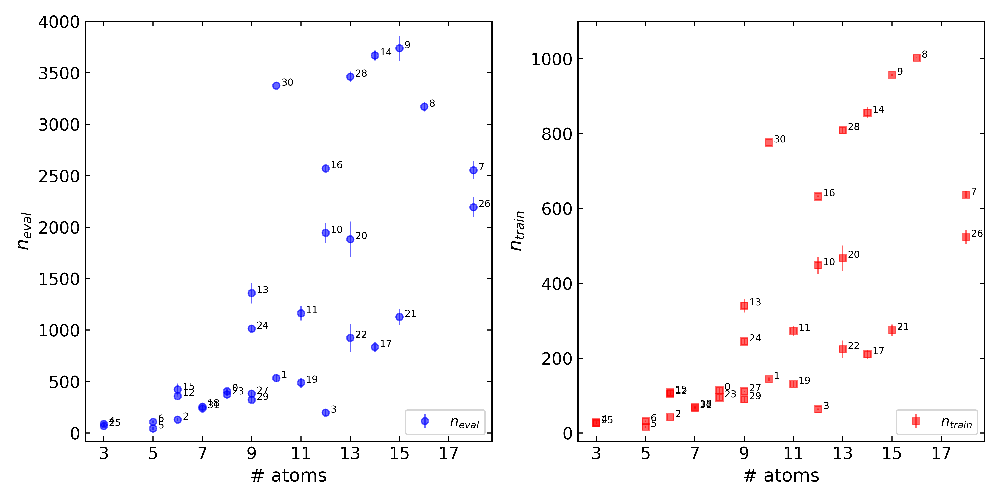

# Scaling Behaviour

In the paper[1] a selection of GAPs were trained but how the number of required
calculations scales with complexity was not explicitly outlined. This scaling 
is presented below for a selection of systems.

### Alkanes

As a semi-ideal case, linear alkanes are first considered. The number of 
total evaluations (*n*eval), number of training configurations 
(*n*train) and the resulting τacc(El = 1 kcal 
mol-1, ET=10El, T=300 K) are plotted as a 
function of the carbon chain length (*alkane_scaling.py*).

Despite the symmetry, the required number of calculations for τacc > 1 ps
consistently is roughly linear up to pentane at which point the maximum number of AL 
iterations (100) precludes further increases. Note that while the number of training 
configurations hits the maximum at 1000 they are CUR selected within the gap_fit 
code down to 500 (default `gt.GTConfig.gap_default_soap_params['n_sparse'] = 500` 
at the time of writing).

### Small Organic Molecules

For a more diverse set of molecules (organic solvents)

plotting the number of configurations required to generate a GAP with τacc > 1 ps 
(parameters as above)

suggests no strong correlation, only that - as expected - larger molecules
require more training evaluations.

### References

[1] T. Young et. al, *Chem. Sci.*, 2021.

